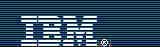
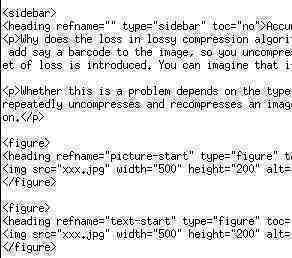

This article is the "Graphics programming with libtiff, Part 2. And now for a little color" tutorial by Michael Still rewritten to reflect differences between libtiff and LibTiff.Net.

Summary
-------

TIFF is an extremely common but quite complex raster image format. LibTiff.Net, a free managed implementation of the TIFF specification, based on LibTiff, a standard ANSI C implementation. This article shows you how to use LibTiff.Net for grayscale and color imaging. 

This article - a continuation of the [previous article](~/articles/KB/black-and-white.html) on black and white graphics programming with LibTiff.Net - covers grayscale and color imaging. It assumes that you have read and understand the code from the black and white article. First let's review some theory about how the image data is stored for color and grayscale. This theory applies to all imaging formats. Then we'll cover the specifics of using LibTiff.Net. 

A bit of terminology
--------------------

Images are made up of pixels. In black and white imaging, the pixel has one of two values, 0 or 1. This can be represented in a single bit. For grayscale and color images however, the pixel needs to store a much greater range of values; if a pixel was to have 255 levels of gray, we would need 8 bits to store that pixel. Each of these values is called a sample. TIFF expresses the size of the value in a tag called <xref:BitMiracle.LibTiff.Classic.TiffTag>.BITSPERSAMPLE. This will be 1 for black and white, and some larger number for grayscale. 

For color images, we need to store even more information. For each pixel we will need to store a red, green, and blue value. Each of these values is stored in a separate *sample*. Therefore, we will need to define TiffTag.SAMPLESPERPIXEL. This will be 1 for black and white, or grayscale, but will normally be 3 for color images. We also need to define the size of each sample, so we'll still need to set a value for TiffTag.BITSPERSAMPLE. 

Theory of color and grayscale storage
-------------------------------------

The first thing we need to understand to be able to support color and grayscale images is the format of the image data within memory. There are two main representations for color and grayscale images. I'll explain these by describing grayscale, and then extend it to color. 

### Direct storage of pixel data

If you remember the way pixel information was stored in the black and white images from the [previous article](~/articles/KB/black-and-white.html), the information was just in the strips. You can also do this with grayscale and color images, but this representation of image data is quite inefficient. For example, in a scenario in which the image has a solid background, there are many pixels with the same value. If the pixel data is stored in the strips, then this value will waste a large amount of space. 

Thankfully, there is a more efficient way to store image data. Imagine a simple four-color, 24-bit-per-pixel image. If we build a lookup table of the four color values (the 24-bit values that represent those colors), then we just need to store the relevant entry number of the color in the image strip itself. This can be done in only two bits, instead of the full 24. 

The math looks something like this: A 24-bit color image that is 1,000 by 1,000 pixels will take 24 million bits to store. The same image, if it was a four color image, would take 4 million bits for the strip data, and 98 bits for the color table. Neither of these numbers includes header and footer information for the file format, and the numbers are for uncompressed bitmaps. The advantages of the lookup table are obvious. This style of lookup table is called a *palette*, probably because of those things painters carry around. 

This concept works for grayscale images as well. The only difference is that the "colors" in the palette are just shades of gray. 

### Compression algorithms in LibTiff.Net

Several compression algorithms are available within LibTiff.Net. The table below helps sort them out. 

Table 1. LibTiff.Net compression algorithms

|Compression algorithm|Well suited for|TiffTag.COMPRESSION|
|---|---|---|
|CCITT Group 4 Fax and Group 3 Fax|This entry is here for completeness. If you're coding for black and white images, then you're probably using the CCITT fax compression methods. These compression algorithms don't support color.|Compression.CCITTFAX3, Compression.CCITTFAX4|
|JPEG|JPEG compression is great for large images such as photos. However, the compression is normally lossy (in that image data is thrown away as part of the compression process). This makes JPEG very poor for compressing text which needs to remain readable. The other thing to bear in mind is that the loss is cumulative - see the next section for more information about this.|Compression.JPEG|
|LZW|This is the compression algorithm used in GIF images. There were the licensing requirements from Unisys, but this requirements are gone now and this compression codec is useful for certain types of images. See note below.|Compression.LZW|
|Deflate|This is the gzip compression algorithm, which is also used for PNG. It is the compression algorithm I would recommend for color images. See note below for another opinion.|Compression.DEFLATE|

libtiff FAQ gives following table for selection of color space and compression scheme. 
 
Table 2. Selection of color space and compression scheme as proposed in libtiff FAQ. 

|Application|Compression scheme and color space|
|---|---|
|Bilevel|dithered or very complex imagery colorspace black and white. compression G3, G4, or perhaps JBIG (last one is unsupported by LibTiff.Net)|
|Bilevel|artificial imagery colorspace black and white. compression G3 or G4|
|Normal range grayscale or color photographic imagery|- If compression is more important than quality<br>colorspace Grayscale or YCbCr. compression JPEG. The YCbCr color space and JPEG compression scheme are de facto related. Other than using JPEG as compression scheme, there is in our humble opinion no good reason for using YCbCr.<br>- If quality is more important than compression<br>colorspace Grayscale, RGB, or CIE L\*a\*b\*. compression LZW or Deflate<br>- If quality is of utmost importance<br>colorspace 16bit per channel or even floating point RGB, or 16bit per channel CIE L\*a\*b\*. compression LZW or Deflate|
|Normal range Grayscale or color artificial imagery|- If the number of colors <=256<br>colorspace Palette would be most suitable. compression LZW or Deflate<br>- If the number of colors >256<br>colorspace Grayscale, RGB, or CIE L\*a\*b\*. compression LZW or Deflate|
|Dynamic range Grayscale or color imagery|colorspace floating point Grayscale or RGB. compression LZW or Deflate|

### Accumulating loss?

Why does the loss in lossy compression algorithms such as JPEG accumulate? Imagine that you compress an image using JPEG. You then need to add, say, a barcode to the image, so you uncompress the image, add the barcode, and recompress it. When the recompression occurs, a new set of loss is introduced. You can imagine that if you do this enough, then you'll end up with an image that is a big blob. 

Figure 1. The picture before compression


Figure 2. The sample text before compression


The code I used had a "quality" rating of 25% on the JPEG compression, which is a way of tweaking the loss of the compression algorithm. The lower the quality, the higher the compression ratio. The default is 75%. 

Figure 3. The picture after 200 recompressions



Figure 4. The text after 200 recompressions



Writing a color image
---------------------

Now we'll write a color image to disk. Remember that this is a simple example and can be elaborated on greatly. 

Listing 1. Writing a color image

```cs
using BitMiracle.LibTiff.Classic;

namespace WriteColorTiff
{
    class Program
    {
        static void Main(string[] args)
        {
            // Open the output image
            using (Tiff output = Tiff.Open("output.tif", "w"))
            {
                if (output == null)
                {
                    System.Console.Error.WriteLine("Could not open outgoing image");
                    return;
                }

                // We need to know the width and the height before we can malloc
                int width = 42;
                int height = 42;
                byte[] raster = new byte[width * height * 3];

                // Magical stuff for creating the image
                // ...

                // Write the tiff tags to the file
                output.SetField(TiffTag.IMAGEWIDTH, width);
                output.SetField(TiffTag.IMAGELENGTH, height);
                output.SetField(TiffTag.COMPRESSION, Compression.DEFLATE);
                output.SetField(TiffTag.PLANARCONFIG, PlanarConfig.CONTIG);
                output.SetField(TiffTag.PHOTOMETRIC, Photometric.RGB);
                output.SetField(TiffTag.BITSPERSAMPLE, 8);
                output.SetField(TiffTag.SAMPLESPERPIXEL, 3);

                // Actually write the image
                if (output.WriteEncodedStrip(0, raster, width * height * 3) == 0)
                {
                    System.Console.Error.WriteLine("Could not write image");
                    return;
                }

                output.Close();
            }
        }
    }
}
```

This code shows some of the things we've discussed in theory. The image has three samples per pixel, each of eight bits. This means that the image is a 24-bit RGB image. If this was a black and white or grayscale image, then this value would be one. The <xref:BitMiracle.LibTiff.Classic.Photometric>.RGB says that the image data is stored within the strips themselves (as opposed to being paletted) - more about this in a minute. 

The other interesting thing to discuss here is the planar configuration of the image. Here I've specified <xref:BitMiracle.LibTiff.Classic.PlanarConfig>.CONTIG, which means that the red green and blue information for a given pixel is grouped together in the strips of image data. The other option is PlanarConfig.SEPARATE, where the red samples for the image are stored together, then the blue samples, and finally the green samples. 

### Other values for samples per pixel?

In my example, I have three samples per pixel. If this was a black and white image, or a grayscale image, then we would have one sample per pixel. 

There are other valid values as well; for instance, sometimes people will store a transparency value for a given pixel, an *alpha channel*. This would result in having four samples per pixel. 

It is possible to have an arbitrary number of samples per pixel, which is good if you need to pack in extra information about a pixel. *Note that doing this can break image viewers that make silly assumptions - I once had to write code for a former employer to strip out alpha channels and the like so that their PDF generator wouldn't crash.*

Writing a paletted color image
------------------------------

So how do we write a paletted version of this image? Well, LibTiff.Net makes this really easy - all we need to do is change the value of TiffTag.PHOTOMETRIC to Photometric.PALETTE. It's not really worth including an example in this article, given it's a one word change. 

Reading a color image
---------------------

Now all we have to do is work out how to read other people's color and grayscale images reliably, and we're home free. Initially, I was very tempted to gloss over the <xref:BitMiracle.LibTiff.Classic.Tiff.ReadRGBAStrip(System.Int32,System.Int32[])> and <xref:BitMiracle.LibTiff.Classic.Tiff.ReadRGBATile(System.Int32,System.Int32,System.Int32[])> calls, which hide some of the potential ugliness from the caller. However, these functions have some limitations, which are expressed in the documentation for <xref:BitMiracle.LibTiff.Classic.Tiff.ReadRGBAStrip(System.Int32,System.Int32[])>

There are a couple of odd things about this function. First, it defines (0, 0) to be in a different location than all the other code that we have been writing. In the previous code, the (0, 0) point has been in the top left of the image. This call defines (0, 0) to be in the bottom left. The other limitation is that not all valid values for bits per sample are supported. If you find these quirks unacceptable, then remember that you can still use <xref:BitMiracle.LibTiff.Classic.Tiff.ReadEncodedStrip(System.Int32,System.Byte[],System.Int32,System.Int32)> in the same manner that I did for the black and white images in the previous article. 

Listing 2. Reading a color image with ReadRGBAImage

```cs
using BitMiracle.LibTiff.Classic;

namespace ReadColorTiff
{
    class Program
    {
        static void Main(string[] args)
        {
            // Open the TIFF image
            using (Tiff image = Tiff.Open(args[0], "r"))
            {
                if (image == null)
                {
                    System.Console.Error.WriteLine("Could not open incoming image");
                    return;
                }

                // Find the width and height of the image
                FieldValue[] value = image.GetField(TiffTag.IMAGEWIDTH);
                int width = value[0].ToInt();

                value = image.GetField(TiffTag.IMAGELENGTH);
                int height = value[0].ToInt();

                int imageSize = height * width;
                int[] raster = new int[imageSize];

                // Read the image into the memory buffer
                if (!image.ReadRGBAImage(width, height, raster))
                {
                    System.Console.Error.WriteLine("Could not read image");
                    return;
                }

                // Here I fix the reversal of the image (vertically) and show you
                // how to get the color values from each pixel
                for (int e = height - 1; e != -1; e--)
                {
                    for (int c = 0; c < width; c++)
                    {
                        int red = Tiff.GetR(raster[e * width + c]);
                        int green = Tiff.GetG(raster[e * width + c]);
                        int blue = Tiff.GetB(raster[e * width + c]);
                    }
                }

                image.Close();
            }
        }
    }
}
```

Advanced topics
---------------

Well, now that we've covered reading and writing basically any image format we can think of, there are two final topics. 

### Storing TIFF data in places other than files

All the examples to this point have read and written with files. There are many scenarios in which you wouldn't want to store your image data in a file, but would still want to use LibTiff.Net and TIFF. For example, you might have customer pictures for id cards, and these would be stored in a database. 

The example I am most familiar with is PDF documents, where you can embed images into the document. These images can be in a subset of TIFF if desired, and TIFF is clearly the choice for black and white images. 

LibTiff.Net allows you to replace the file/stream input and output functions in the library with your own. This is done with the <xref:BitMiracle.LibTiff.Classic.Tiff.ClientOpen(System.String,System.String,System.Object,BitMiracle.LibTiff.Classic.TiffStream)> method. Here's an example (please note this code would compile and even run without errors, but won't do anything useful): 

```cs
using BitMiracle.LibTiff.Classic;

namespace UsingClientOpen
{
    class Program
    {
        /// <summary>
        /// Custom stream for LibTiff.Net.
        /// Please consult documentation for TiffStream class for method parameters meaning.
        /// </summary>
        class MyStream : TiffStream
        {            
            // You may implement any constructor you want here.

            public override int Read(object clientData, byte[] buffer, int offset, int count)
            {
                // stub implementation
                return -1;
            }

            public override void Write(object clientData, byte[] buffer, int offset, int count)
            {
                // stub implementation
            }

            public override long Seek(object clientData, long offset, System.IO.SeekOrigin origin)
            {
                // stub implementation
                return -1;
            }

            public override void Close(object clientData)
            {
                // stub implementation
            }

            public override long Size(object clientData)
            {
                // stub implementation
                return -1;
            }
        }

        static void Main(string[] args)
        {
            MyStream stream = new MyStream();

            // Open the TIFF image for reading
            using (Tiff image = Tiff.ClientOpen("custom", "r", null, stream))
            {
                if (image == null)
                    return;

                // Read image data here the same way
                // as if LibTiff.Net was using regular image file
                image.Close();
            }
        }
    }
}
```

### Converting color to grayscale

How do you convert color images to grayscale? My first answer was to just average the red, green, and blue values. That answer is wrong. The reality is that the human eye is much better at seeing some colors than others. To get an accurate grayscale representation, you need to apply different coefficients to the color samples. Appropriate coefficients are 0.299 for red, 0.587 for green, and 0.114 for blue. 

Conclusion
----------

In this article I've discussed how to program with LibTiff.Net for grayscale and color images. I've shown you some sample code that should help to get you started. You should now know enough to have a great time coding with LibTiff.Net. 
