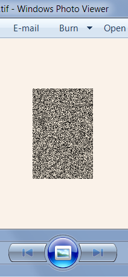

This article explains how to setup your environment to read and write TIFF files in your applications using pre-built LibTiff.Net library. 

If you prefer to use source code for LibTiff.Net, please read [this article](~/articles/KB/building-source.html). It describes the steps you need to take to build library from source code package. 

Using LibTiff.Net in your WinForms, console, WPF or ASP.NET application
-----------------------------------------------------------------------

1. Start Visual Studio IDE. Create a new project or open existing one. 

2. Add NuGet reference to [BitMiracle.LibTiff.NET](https://www.nuget.org/packages/BitMiracle.LibTiff.NET/)

3. To avoid typing full references, it is best to add following using statement to the already existing ones in your source file 

    ```cs
    using BitMiracle.LibTiff.Classic;
    ```

4. Add the following method to your application source code 

    ```cs
    private void createRandomTiff()
    {
        int width = 100;
        int height = 150;
        string fileName = "random.tif";

        using (Tiff output = Tiff.Open(fileName, "w"))
        {
            output.SetField(TiffTag.IMAGEWIDTH, width);
            output.SetField(TiffTag.IMAGELENGTH, height);
            output.SetField(TiffTag.SAMPLESPERPIXEL, 1);
            output.SetField(TiffTag.BITSPERSAMPLE, 8);
            output.SetField(TiffTag.ORIENTATION, Orientation.TOPLEFT);
            output.SetField(TiffTag.ROWSPERSTRIP, height);
            output.SetField(TiffTag.XRESOLUTION, 88.0);
            output.SetField(TiffTag.YRESOLUTION, 88.0);
            output.SetField(TiffTag.RESOLUTIONUNIT, ResUnit.INCH);
            output.SetField(TiffTag.PLANARCONFIG, PlanarConfig.CONTIG);
            output.SetField(TiffTag.PHOTOMETRIC, Photometric.MINISBLACK);
            output.SetField(TiffTag.COMPRESSION, Compression.NONE);
            output.SetField(TiffTag.FILLORDER, FillOrder.MSB2LSB);

            Random random = new Random();
            for (int i = 0; i < height; ++i)
            {
                byte[] buf = new byte[width];
                for (int j = 0; j < width; ++j)
                    buf[j] = (byte)random.Next(255);

                output.WriteScanline(buf, i);
            }

            output.WriteDirectory();
        }

        System.Diagnostics.Process.Start(fileName);
    }
    ```

5. Call createRandomTiff() method from your code. This should produce random.tif file and open it in default TIFF viewer. 

    

Conclusion
----------

Now you should be able to read and write TIFF in your applications using LibTiff.Net library. This is only the beginning, however. We encourage you to read through the documentation accompanying the library and review samples. You might also want to check out the [Bit Miracle blog](https://bitmiracle.com/blog/).
